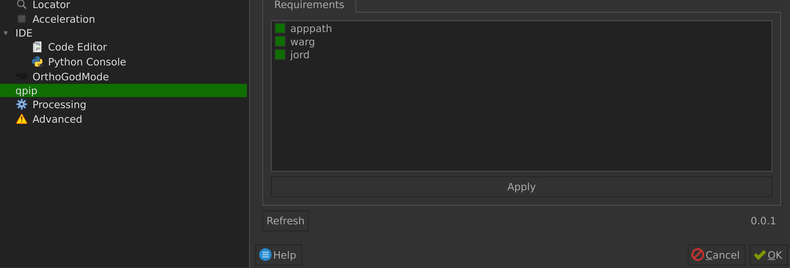

# Eqip (Maybe Eqip instead?)

Install pip package for within QGIS.

## SETUP

First, you need to install the following dependencies:

see [eqip/requirements.txt](eqip/requirements.txt)

Hereafter you have the following options:

### Clone the repository into Qgis plugins directory

clone the repository into the plugins directory of your qgis installation.

for windows and with the profile default this is:

AppData/Roaming/QGIS/QGIS3/profiles/default/python/plugins

### Install by symlinking into Qgis plugins directory

for the default profile this is:

run python dev_install_plugin.py

### From custom plugin repository

Open Qgis and go to Plugins > Add > Repository > URL: http://10.0.52.7:5000/qgisplugins/

Click Ok

Navigate to All plugins find Eqip and install 